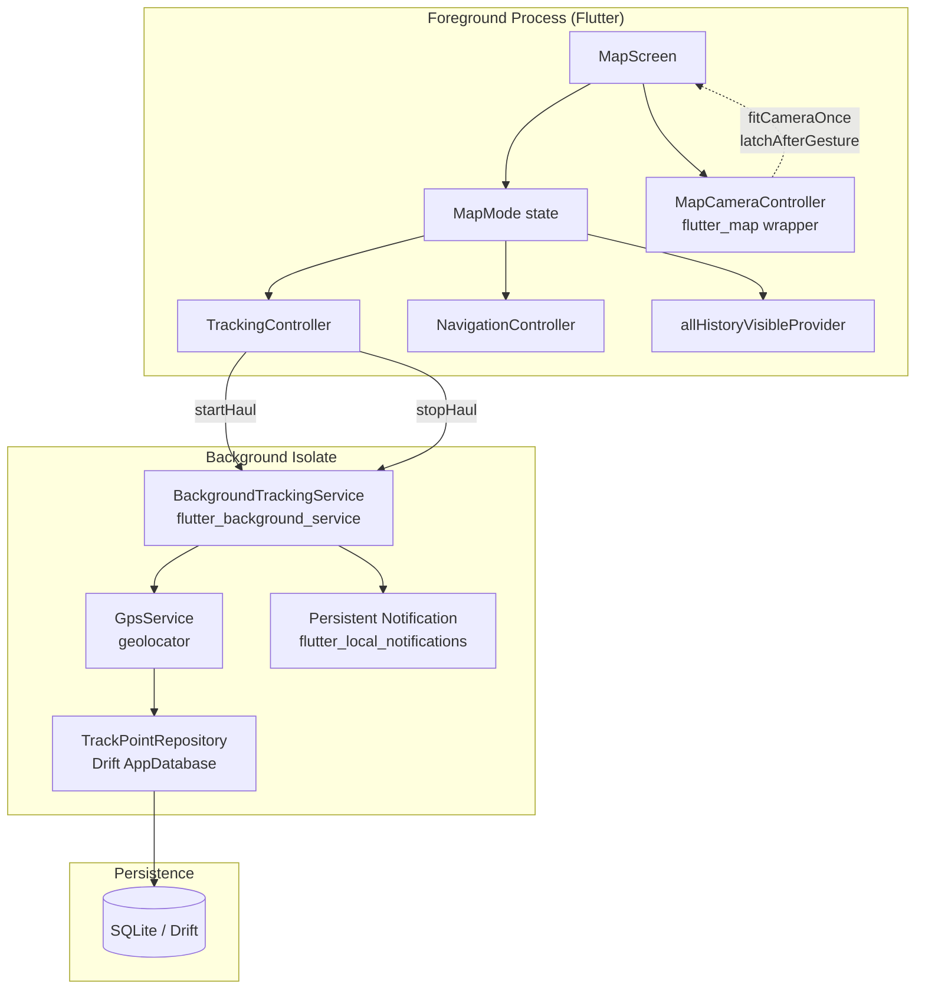
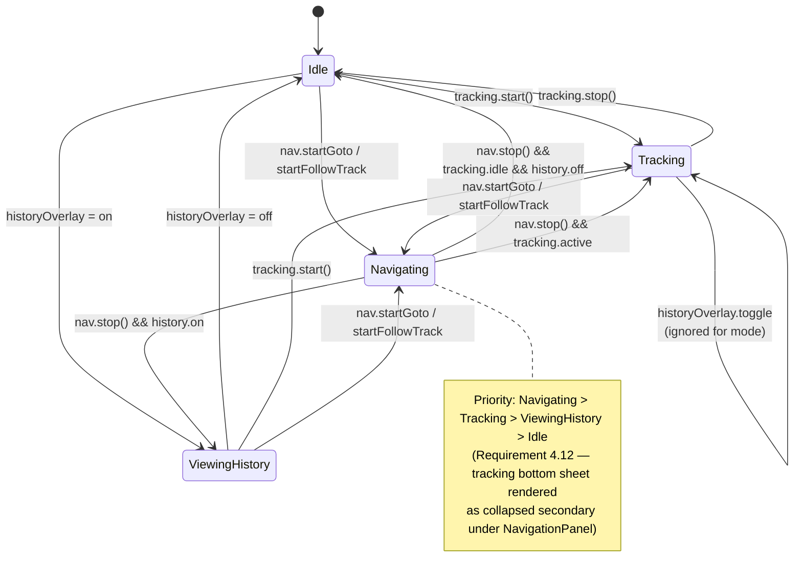
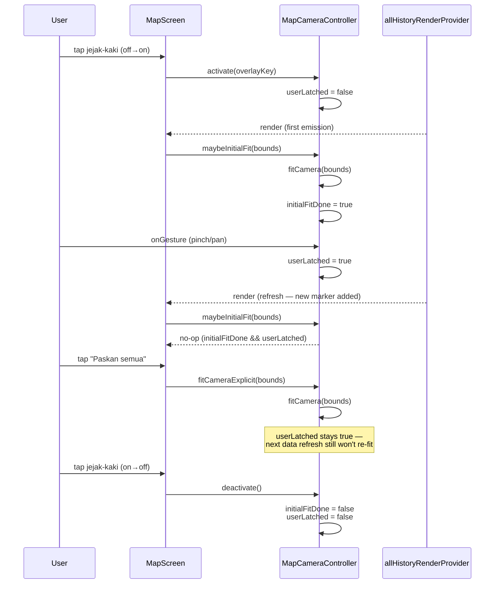

# Design Document

## Overview

Dokumen ini merancang implementasi **batch perbaikan UX dan bugfix `feat/ux-tracking-improvements-pr21`** pada aplikasi Langgeng Sea. Lima area dari requirements saling terkait di sekitar `MapScreen`, sehingga design-nya disusun sebagai sebuah set modifikasi terkoordinasi pada tiga sumbu:

1. **Reliability** (Requirement 1) — Tracking GPS harus andal di background, Doze_Mode, dan saat screen-off. Pekerjaan utamanya di luar UI: foreground service Android (`flutter_background_service`) yang menjalankan perolehan GPS terpisah dari proses Flutter foreground, plus alur permission `ACCESS_BACKGROUND_LOCATION` dan retry logic saat OS mematikan service.
2. **Interaction** (Requirement 2, 3, 5) — Peta dan daftar marker harus bisa dieksplorasi bebas, Polyline/Marker harus bisa ditekan dengan konsisten, kustomisasi warna & kategori harus persist. Ini sebagian besar UI state: sebuah `MapCameraController` pembungkus `MapController` dari `flutter_map` yang menegakkan aturan "single initial fit" via latch boolean, widget `TrackPopup`, dan dialog `ChangeMarkerCategorySheet`.
3. **Adaptivity** (Requirement 4) — `MapScreen` harus menampilkan kontrol berbeda per-konteks. Solusinya: state `MapMode` terobservasi (enum `Idle | Tracking | Navigating | ViewingHistory`) yang derived secara deterministik dari kombinasi `TrackingController`, `NavigationController`, dan `allHistoryVisibleProvider`. UI di-split menjadi sub-widget (`IdleControls`, `TrackingBottomSheet`, `NavigationOverlay`, `HistoryOverlayControls`) yang dipilih berdasarkan `MapMode`.

Design ini berangkat dari arsitektur yang sudah ada (Riverpod + Drift + `flutter_map` + Clean Liquid Glass theme) dan fokus pada perubahan bedah yang presisi; kita tidak mengganti pattern yang sudah jalan (mis. `NotifierProvider`, `AsyncValue`, `AppColors.resolveHaulColor`).

### Research Notes

- **`flutter_background_service` lifecycle vs geolocator foreground service.**
  `geolocator` punya mode `ForegroundLocationConfig` bawaan, tapi ia dimaksudkan hanya untuk mempertahankan stream di foreground; ia tidak menjamin kelanjutan stream saat app benar-benar di background + screen-off di Android 8+. `flutter_background_service_android` menjalankan sebuah `Service` Kotlin terpisah yang ber-lifecycle independen dari Flutter engine foreground. Design memakai `flutter_background_service` sebagai **process host** dan `geolocator` (melalui `GpsService`) sebagai **GPS acquirer**, keduanya **di dalam** isolate background service. ([flutter_background_service docs](https://pub.dev/packages/flutter_background_service)).
- **Android Doze_Mode behavior.**
  Saat perangkat masuk Doze_Mode, `LocationManager` hanya di-deliver ke aplikasi yang memegang `FOREGROUND_SERVICE_LOCATION` + notifikasi persistent. Frekuensi delivery tetap dibatasi OS; pengalaman di lapangan menunjukkan interval delivery naik dari 1-2 detik ke 15-30 detik saat Doze. Requirement 1.4 memberi batas toleran 30 detik yang konsisten dengan perilaku OS. Manifest yang ada sudah mendeklarasikan semua permission yang dibutuhkan.
- **`flutter_map` tap on `PolylineLayer`.**
  Versi `flutter_map: ^7.0.2` yang dipakai men-support `hitNotifier` pada `PolylineLayer` — sebuah `ValueNotifier<LayerHitResult<R>?>` yang mencatat polyline mana yang "hit" pada gesture terakhir. Dibungkus dengan `GestureDetector` transparan di atas `FlutterMap`, kita bisa mendapatkan tap-to-polyline tanpa custom hit-testing. Tolerance diatur via `strokeWidth` efektif yang dipakai untuk hit-test (ref `Polyline.strokeWidth` + padding logical pixel). ([flutter_map hit testing example](https://docs.fleaflet.dev/layers/polyline-layer#hit-detection)).
- **Contrast ratio on OSM tiles.**
  WCAG AA requires 4.5:1 contrast for "normal text"; for line graphics pada peta, white-border + saturated stroke (sudah dipakai di `allHistoryRenderProvider` overlay dengan `borderStrokeWidth: 0.6, borderColor: white α=0.35`) memberi kontras efektif ≥ 4.5:1 terhadap baik light OSM tile maupun OpenSeaMap seamark layer. Untuk mode dark (`app_theme.dart` dark variant), warna dari `AppColors.pickablePalette` sudah diuji manual > 4.5:1 terhadap `darkBg`.

## Architecture

### High-Level Flow



`TrackingController` tidak lagi subscribe ke `GpsService.watchPosition()` di foreground isolate; ia men-delegasi ke `BackgroundTrackingService`. UI foreground tetap mendengarkan perubahan state melalui `track_point_repository.watchByHaul()` (Drift stream) — karena SQLite file-based dan reactive, setiap insert dari background isolate tertangkap foreground stream tanpa IPC tambahan.

### Map Mode State Machine



Mode adalah **fungsi murni** dari tiga boolean `(tracking, navigating, historyOverlayActive)`:

```text
deriveMapMode(tracking, navigating, historyOverlayActive) =
  | navigating            -> Navigating
  | tracking              -> Tracking
  | historyOverlayActive  -> ViewingHistory
  | otherwise             -> Idle
```

Fungsi deterministik ini bisa di-property-test atas 2³ = 8 kombinasi (Requirement 4 Correctness).

### History Overlay Camera Control



`MapCameraController` mengambil alih peran `_fittedOverlayKey` dan `_followingUser` yang saat ini terserak di dalam `_MapScreenState` (lihat `map_screen.dart:82-92` dan `_fitOverlayBounds`), menjadi state terkapsulasi dengan API eksplisit.

## Components and Interfaces

Komponen dibagi per-requirement. Komponen bertanda (baru) dibuat pada PR ini; komponen tanpa tanda dimodifikasi.

### Requirement 1: Background Tracking

**`BackgroundTrackingService`** (baru)
Lokasi: `app/lib/features/tracking/data/background_tracking_service.dart`.

```dart
abstract class BackgroundTrackingService {
  /// Mulai foreground service + persistent notification. Harus dipanggil
  /// di foreground isolate (pengguna menekan "Mulai tracking").
  Future<void> start({
    required String haulId,
    required String notificationTitle,
    required String notificationBody,
  });

  /// Hentikan foreground service + dismiss notification.
  Future<void> stop();

  /// Stream status service untuk UI (running / stopped / restarting).
  Stream<BackgroundTrackingStatus> watchStatus();

  /// Di-invoke hanya di dalam isolate background (entrypoint).
  /// Menyetel listener GpsService dan menulis Track_Point.
  static Future<void> onBackgroundStart(ServiceInstance service);
}

enum BackgroundTrackingStatus { stopped, starting, running, restarting, failed }
```

Implementasi menggunakan `FlutterBackgroundService` dari paket `flutter_background_service`. `onBackgroundStart` adalah top-level entrypoint yang dijalankan di isolate background — ia menginstansiasi `GeolocatorGpsService`, sebuah instance `AppDatabase` baru (Drift re-opens file DB dari isolate lain secara aman via `NativeDatabase`), `TrackPointRepository`, dan melakukan `_gps.watchPosition(distanceFilterMeters: 2).listen(_persist)`.

Retry logic saat service dihentikan OS (Requirement 1.7): `TrackingController` mendengarkan `watchStatus()`; pada transisi `running → stopped` sementara `state.isRecording == true`, ia menjadwalkan `_restart()` dengan jeda `[1s, 2s, 4s]` (eksponensial). Pada attempt ke-4 gagal, state ditandai `failed`, UI menampilkan banner error non-blocking, dan Track_Point yang sudah tersimpan tetap utuh (insert-only di DB).

**`TrackingController`** (modifikasi)
- `startHaul` tidak lagi memanggil `_gps.watchPosition().listen(_onReading)`. Sebagai gantinya, ia memanggil `backgroundTrackingService.start(haulId: haul.id, ...)`.
- `_onReading` berubah peran: tidak men-drive insert ke repository (itu sudah dilakukan di isolate background), tapi tetap men-drive **live metrics in foreground**. Foreground isolate men-subscribe `trackPointRepository.watchByHaul(haulId)` untuk mendapatkan point-point yang sudah masuk dan merekomputasi metric incremental dari diff stream terakhir.
- `detectRecoverableHaul` dan `resumeHaul` tetap — tetapi `resumeHaul` juga memanggil `backgroundTrackingService.start(...)`.

**`PermissionFlow`** (baru, helper)
Lokasi: `app/lib/features/tracking/application/tracking_permission_flow.dart`.

```dart
sealed class TrackingPermissionResult {}
class Granted extends TrackingPermissionResult {}
class GrantedForegroundOnly extends TrackingPermissionResult {}
class Denied extends TrackingPermissionResult {}

Future<TrackingPermissionResult> ensureTrackingPermissions({
  required GpsService gps,
  required PermissionHandler handler, // thin wrapper around permission_handler
  required void Function(String explanationId) showRationale,
});
```

Alur:
1. Check `ACCESS_FINE_LOCATION` → request jika belum.
2. Jika granted, check `ACCESS_BACKGROUND_LOCATION` (hanya di Android 10+).
3. Jika belum ada, tampilkan rationale dialog (`showRationale`) → request.
4. Hasil: `Granted` (both), `GrantedForegroundOnly` (fine only), `Denied` (no fine).
5. Pada Android 13+ (`POST_NOTIFICATIONS`), juga request — foreground service Android 14 mewajibkan.

`TrackingController.startHaul` memanggil `ensureTrackingPermissions` lebih dulu. Pada `GrantedForegroundOnly`, kontroller menampilkan warning non-blocking ("Tracking di background tidak aktif — data akan terputus jika layar dimatikan") dan tetap memulai sesi tanpa background service (Requirement 1.6).

**Android manifest** (modifikasi)
`AndroidManifest.xml` sudah mendeklarasikan semua permission yang dibutuhkan. Yang perlu ditambahkan: `<service>` declaration untuk `flutter_background_service_android` (plugin registers otomatis via manifest merge, tapi kita perlu **menghapus** `NOTE` block yang melarang custom service, dan menambahkan `android:foregroundServiceType="location"` agar Android 14 mengizinkan).

### Requirement 2: Free Zoom/Pan in History Overlay

**`MapCameraController`** (baru)
Lokasi: `app/lib/features/map/application/map_camera_controller.dart`.

```dart
class MapCameraController {
  MapCameraController(this._mapController);
  final MapController _mapController;

  /// Key yang mengidentifikasi siklus overlay aktif saat ini. Pada
  /// toggle ON baru, caller panggil activate(newKey) yang me-reset
  /// state latch; pada toggle OFF, caller panggil deactivate().
  Object? _activeOverlayKey;
  bool _initialFitDone = false;
  bool _userLatched = false;

  void activate(Object overlayKey) {
    _activeOverlayKey = overlayKey;
    _initialFitDone = false;
    _userLatched = false;
  }

  void deactivate() {
    _activeOverlayKey = null;
    _initialFitDone = false;
    _userLatched = false;
  }

  /// Dipanggil oleh MapScreen pada setiap rebuild overlay dengan bounds
  /// terbaru. Melakukan fitCamera() hanya jika initial-fit belum dilakukan
  /// untuk siklus aktif ini. No-op jika user sudah gesture ATAU jika
  /// sudah pernah fit.
  void maybeInitialFit(LatLngBounds bounds) {
    if (_activeOverlayKey == null) return;
    if (_initialFitDone) return;
    if (_userLatched) return;
    _mapController.fitCamera(CameraFit.bounds(bounds: bounds, padding: _defaultPadding));
    _initialFitDone = true;
  }

  /// Dipanggil dari handler tombol "Paskan semua". Selalu memicu fit,
  /// tanpa mengubah _userLatched.
  void fitCameraExplicit(LatLngBounds bounds) {
    _mapController.fitCamera(CameraFit.bounds(bounds: bounds, padding: _defaultPadding));
  }

  /// Dipanggil dari MapOptions.onPositionChanged(hasGesture: true).
  void onUserGesture() {
    _userLatched = true;
  }
}
```

**`MapScreen`** (modifikasi)
- Hapus `_fittedOverlayKey`, `_fitAllHistoryBounds`, `_fitOverlayBounds` helper.
- Instansiasi `MapCameraController` sekali di `initState`.
- `onPositionChanged`: jika `hasGesture`, panggil `_camera.onUserGesture()`.
- Saat `allHistoryOn` berubah `false → true`, panggil `_camera.activate(historyOverlayKey)`; pada `true → false`, panggil `_camera.deactivate()`.
- Dalam `allHistoryAsync.whenData((render) { ... })`, panggil `_camera.maybeInitialFit(render.bounds!)`.
- Tombol "Paskan semua" baru di `HistoryOverlayControls` memanggil `_camera.fitCameraExplicit(bounds)`.

### Requirement 3: Polyline Contrast & Tap Popup

**`HistoryPolylineLayer`** (baru)
Lokasi: `app/lib/features/map/presentation/widgets/history_polyline_layer.dart`.

Bertanggung jawab merender polyline histori dengan kontras yang cukup dan menyediakan hit-testing:

```dart
class HistoryPolylineLayer extends ConsumerStatefulWidget {
  final List<HaulTrackRender> tracks;
  final void Function(HaulTrackRender hit, LatLng tapPosition) onTrackTap;
  // ...
}
```

Implementasi memakai `PolylineLayer<HaulTrackRender>` dengan `hitNotifier` dari `flutter_map`. Setiap `Polyline` dibuat dua-layer (border + main) untuk kontras:

```dart
Polyline<HaulTrackRender>(
  points: track.points,
  strokeWidth: 5,                       // ≥ 4 px per AC 3.2
  color: AppColors.resolveHaulColor(...).withValues(alpha: 1.0),
  borderStrokeWidth: 2,
  borderColor: _contrastBorder(theme),  // white on light, black/deep on dark
  hitValue: track,
)
```

`hitValue` adalah `HaulTrackRender` sendiri, sehingga `hitNotifier` akan mengembalikan track yang di-tap. Hit tolerance diperoleh dari `strokeWidth` efektif (5 + 2 border ≈ 7 px), plus buffer logical 16 px yang dikelola dengan memperbesar `Polyline.borderStrokeWidth` hanya untuk hit-testing.

Karena `flutter_map 7.x` tidak memisah visual vs hit stroke width, design-nya: `strokeWidth: 5` visual, dan wrap hit area dengan `TouchArea` invisible overlay — tapi pendekatan lebih sederhana: tambahkan `Polyline` invisible dengan `strokeWidth: 16, color: Colors.transparent`, dan `hitValue: track` (ini pattern yang direkomendasikan dokumentasi flutter_map).

**`TrackPopup`** (baru)
Lokasi: `app/lib/features/map/presentation/widgets/track_popup.dart`.

```dart
class TrackPopup extends ConsumerWidget {
  final HaulTrackRender track;
  final String? storedName;      // dari haul.name atau trip.name
  final DateTime startedAt;
  final TrackKind kind;           // haul | trip
  final VoidCallback onClose;
  final VoidCallback onNavigate;
  // ...
}

enum TrackKind { haul, trip }
```

Fungsi pembantu (pure):

```dart
String trackDisplayLabel({String? storedName, required DateTime startedAt}) {
  if (storedName != null && storedName.trim().isNotEmpty) return storedName;
  return DateFormat('yyyy-MM-dd HH:mm').format(startedAt);
}
```

Properti 3.2 (round-trip tap → navigate → back) difasilitasi: `onNavigate` memanggil `navigationControllerProvider.notifier.startFollowTrack(FollowTrackTarget(pathPoints: track.points, ...))` lalu menutup popup. `onClose` dipanggil oleh tap di luar popup atau pada tombol tutup.

**`MapScreen`** (modifikasi)
Tambah layer popup: saat `HistoryPolylineLayer.onTrackTap` memanggil balik, set `_activePopup = TrackPopup(...)` dan tempatkan di atas peta dengan `Positioned` di atas koordinat tap (dikonversi via `MapController.camera.latLngToScreenOffset(...)`). Tap di luar `_activePopup` rectangle menutupnya.

### Requirement 4: Adaptive Map UI via Map_Mode

**`MapMode`** (baru, enum + derivation)
Lokasi: `app/lib/features/map/application/map_mode.dart`.

```dart
enum MapMode { idle, tracking, navigating, viewingHistory }

MapMode deriveMapMode({
  required bool tracking,
  required bool navigating,
  required bool historyOverlayActive,
}) {
  if (navigating) return MapMode.navigating;
  if (tracking)   return MapMode.tracking;
  if (historyOverlayActive) return MapMode.viewingHistory;
  return MapMode.idle;
}

final mapModeProvider = Provider<MapMode>((ref) {
  final tracking = ref.watch(trackingControllerProvider).isRecording;
  final navigating = ref.watch(navigationControllerProvider) is NavigationActive;
  final historyOn = ref.watch(allHistoryVisibleProvider);
  return deriveMapMode(
    tracking: tracking,
    navigating: navigating,
    historyOverlayActive: historyOn,
  );
});
```

**`MapScreen`** (modifikasi)
`build()` memakai `mapModeProvider` untuk memilih widget yang dirender:

```dart
final mode = ref.watch(mapModeProvider);
// ...
body: Stack(children: [
  _MapBase(...),  // peta + tiles + polyline layers (semua mode)
  ...switch (mode) {
    MapMode.idle => [IdleControls(...)],
    MapMode.tracking => [TrackingBottomSheet(...), _StandardMapControls(...)],
    MapMode.navigating => [
        NavigationPanel(...),
        if (trackingAlso) const _CollapsedTrackingMini(),  // Requirement 4.12
      ],
    MapMode.viewingHistory => [HistoryOverlayControls(...), _StandardMapControls(...)],
  },
  const _MapOverflowMenu(),   // Requirement 4.10 akses ke kontrol hidden
]),
```

Transisi 250 ms: masing-masing overlay widget dibungkus `AnimatedSwitcher(duration: 250ms, child: ...)` atau `AnimatedOpacity` sesuai kenyamanan.

Komponen UI baru:
- `IdleControls` (FAB "Mulai tracking", toggle history, tombol my-location)
- `TrackingBottomSheet` (ringkasan distance/duration/speed, tombol "Berhenti tracking", collapsible)
- `HistoryOverlayControls` (toggle jejak kaki off, filter kategori, "Paskan semua")
- `_CollapsedTrackingMini` (mini banner saat Tracking + Navigating bersamaan)
- `_MapOverflowMenu` (three-dot menu berisi kontrol alternatif seperti "Add marker here")

### Requirement 5: Color Pick, Category Edit, Jump-to-Location

**`HaulColorPicker` / `TripColorPicker`** (baru)
Lokasi: `app/lib/features/tracking/presentation/widgets/color_picker_sheet.dart`.

Menggunakan palette `AppColors.pickablePalette` (sudah ada, 8 warna pre-set). Tambahan: field "Custom" yang memunculkan `showColorPicker` dari paket `flutter_colorpicker` (bisa ditambahkan ke `pubspec.yaml` — ~10 KB). Nilai disimpan sebagai `int` ARGB32 via `Haul.colorValue` / `Trip.colorValue`.

Catatan: `Trip.colorValue` **belum ada** pada entitas saat ini (`Trip` di `trip.dart` tidak punya `colorValue`). Design menambahkan field ini di entitas + migrasi Drift (lihat Data Models).

`HaulRepository.setColor` sudah ada. `TripRepository.setColor` akan ditambahkan (analog dengan pattern `HaulRepository.setColor`).

**`EditMarkerCategorySheet`** (baru)
Lokasi: `app/lib/features/marker/presentation/widgets/edit_marker_category_sheet.dart`.

Menampilkan list `MarkerCategory.values` sebagai RadioListTile. Validasi: `MarkerCategory.fromStorageKey` sudah fallback ke `.other` pada key tidak dikenal — untuk mencegah "menetapkan kategori tak terdefinisi", sheet hanya menampilkan `MarkerCategory.values`, jadi invalid secara konstruksi tidak mungkin. Tapi pada layer repository, `updateCategory` akan melakukan assertion runtime untuk defense-in-depth:

```dart
Future<void> updateCategory(String markerId, MarkerCategory category) async {
  // Invariant: category MUST be a member of the enum; this is enforced
  // by the signature itself (Dart enums cannot be extended at runtime),
  // but we log the transition for audit per AC 5.10.
  final before = await getById(markerId);
  if (before == null) throw StateError('Marker $markerId not found');
  log.info('marker.category.change', {
    'markerId': markerId, 'from': before.category.name, 'to': category.name,
  });
  await _dao.updateMarker(
    markerId,
    MarkersCompanion(category: Value(category.storageKey)),
  );
}
```

**`MarkersListScreen`** (modifikasi)
- `_MarkerTile` berubah jadi `InkWell`; `onTap` memanggil `_jumpToMarker(marker)`.
- `_jumpToMarker` melakukan: `context.go('${AppRoutes.map}?focusMarkerId=${marker.id}')` (menggunakan query parameter). Alternatif: route `/map/focus/:markerId` dengan sentinel untuk tetap di shell.
- Konteks menu (long-press atau trailing `IconButton`): "Ubah kategori" → show `EditMarkerCategorySheet`, "Hapus" (existing di masa depan).

**`MapScreen`** (modifikasi)
- Baca `focusMarkerId` dari route saat initState: jika ada, fetch marker via `markerByIdProvider`, `_mapController.move(marker.latLng, max(15, currentZoom))`, aktifkan `markersOverlayEnabledProvider`, dan trigger `MarkerInfoSheet.show()` untuk marker tersebut.

**Router** (modifikasi)
`app_router.dart`: tambah query-parameter support untuk `/` (MapScreen). GoRouter sudah mendukung `state.uri.queryParameters`; tidak perlu path baru. Jika ingin path-based:

```dart
GoRoute(
  path: '/',
  pageBuilder: (_, state) => _noTransition(
    MapScreen(focusMarkerId: state.uri.queryParameters['focusMarkerId']),
  ),
),
```

## Data Models

### `Haul.colorValue`
Sudah ada (`int?` ARGB32). Tidak ada perubahan schema.

### `Trip.colorValue` (baru)
Tambah field `int? colorValue` di `Trip` entitas. Tambah kolom `color_value INTEGER NULL` di `trips` Drift table (lihat `tables.dart`). Migration: Drift `onUpgrade` naikkan schema version + `ALTER TABLE trips ADD COLUMN color_value INTEGER;`.

### `AppMarker` — kategori edit
Field `category` sudah ada (`String` di schema, parsed ke `MarkerCategory` enum). Tidak ada perubahan schema. Operasi `update` dari `MarkerRepository` sudah menangani field ini; yang perlu ditambahkan adalah method helper `updateCategory(id, category)` yang memanggil `_dao.updateMarker` dengan hanya `category` di-set (bukan seluruh record) — agar `ChangeMarkerCategorySheet` tidak perlu round-trip fetch.

### `TrackPoint` — tidak diubah
Requirement 5.9 eksplisit menyatakan `colorValue` hanya di Trip/Haul, tidak pernah mem-mutate Track_Point. Repository-level invariant test mem-verifikasi ini (lihat Testing Strategy).

### `MapMode` & `BackgroundTrackingStatus` (baru, enum di memori saja)
Tidak disimpan di DB. State murni di-Riverpod.

### `HaulTrackRender` (modifikasi)
Sudah ada (`history_overlay_providers.dart:26-32`). Tambahkan field `displayName` agar `TrackPopup` tidak perlu fetch ulang `haul_repository.getById`:

```dart
typedef HaulTrackRender = ({
  String haulId,
  String tripId,
  int orderIndex,
  int? colorValue,
  List<LatLng> points,
  String? storedName,       // haul.name
  DateTime startedAt,
});
```

Provider `allHistoryRenderProvider` dan `tripRenderProvider` di-update untuk mengisi dua field tambahan ini dari `haul` row yang sudah di-fetch.

<!-- Correctness Properties akan ditulis setelah prework -->


## Correctness Properties

*A property is a characteristic or behavior that should hold true across all valid executions of a system — essentially, a formal statement about what the system should do. Properties serve as the bridge between human-readable specifications and machine-verifiable correctness guarantees.*

Sebelum menuliskan properties, prework-analysis di atas direfleksikan untuk menghilangkan redundansi:

- **Requirement 1**: Properties 1.2 (interval ≤ 5s untuk reading valid) dan 1.9 (persist per-reading) digabung menjadi satu invariant "order-preserving filter" — 1.2 sudah tertampung ketika stream preserve ordering + filter akurasi. Properties timing monotonic, restart round-trip, metamorphic fg/bg, permission flow, dan retry tetap berdiri sendiri karena menjamah aspek berbeda.
- **Requirement 2**: Properties 2.1, 2.3, 2.4 semua digabung menjadi invariant **single-initial-fit** (tepat satu auto-fit per siklus aktivasi). Property 2.5 (explicit fit) tetap terpisah karena perilakunya berbeda (memicu fit, tidak mem-flip latch). Round-trip toggle-reset tetap terpisah.
- **Requirement 3**: Properties 3.1, 3.6, dan "contrast-under-theme-toggle" semua digabung menjadi invariant **contrast ≥ 4.5:1 ∀ (color, theme)**. Properties 3.3, 3.3a, dan 3.7 semua ter-cover oleh properti `trackDisplayLabel`. Properti navigate (3.4), hit tolerance (3.8), dan round-trip tap-navigate-back tetap terpisah.
- **Requirement 4**: Properties 4.2-4.5, 4.12, dan "mutual-exclusion-priority" semua digabung menjadi invariant `deriveMapMode` atas 2³ kombinasi boolean. Properties 4.6-4.9 dan "no-forbidden-control" digabung menjadi invariant visible ⊆ allowed. Property 4.10 (overflow) dan round-trip reversibility tetap terpisah.
- **Requirement 5**: Property 5.2 dan round-trip color-persist digabung. Property 5.7, 5.8, dan metamorphic jump-to-location semua digabung. Property 5.9 dan track_point-immutability digabung. Property 5.5 (category update) tetap berdiri sendiri sebagai round-trip kategori. Properti default-color (5.3) dan category-validity invariant tetap terpisah.

Hasil refleksi menghasilkan 14 properti unik berikut.

### Property 1: Background tracking adalah order-preserving filter

*For any* `List<GpsReading> stream` yang dihasilkan `GpsService.watchPosition` saat sesi tracking aktif di background, himpunan `Track_Point` yang persist di `track_point_repository` SHALL merupakan subsequence `stream` yang mempertahankan urutan, dan SHALL tepat sama dengan hasil filter `reading.accuracyMeters == null || reading.accuracyMeters <= 50.0` yang diterapkan pada `stream`. Selain itu, untuk setiap dua `Track_Point` berurutan `(p_i, p_i+1)` yang tersimpan, `p_i.timestamp <= p_i+1.timestamp`.

**Validates: Requirements 1.2, 1.9, Invariant monotonic-timestamps**

### Property 2: Spasial gap antar Track_Point dibatasi kecepatan kapal

*For any* `List<GpsReading> stream` di mana semua reading memiliki `speedMps <= 7.717` (15 knot) dan interval waktu antar reading tersimpan `<= 5` detik, jarak haversine antar setiap pasangan `Track_Point` berurutan yang tersimpan SHALL `<= 50` meter (+ toleransi numerik akurasi GPS 10m).

**Validates: Requirements 1.3**

### Property 3: Restart recovery mempertahankan Track_Point tanpa duplikat

*For any* Trip aktif dengan `Track_Point` set `S` yang tersimpan sebelum `BackgroundTrackingService` dihentikan lalu di-restart, himpunan `Track_Point` setelah restart `S'` SHALL memenuhi: `S ⊆ S'` (tidak ada kehilangan), dan untuk setiap pasang Track_Point di `S'` tidak ada dua row dengan `(haulId, timestamp)` sama (tidak ada duplikat).

**Validates: Requirements 1.7, 1.9, Round-trip restart-recovery**

### Property 4: Path length foreground vs background berjarak ≤ 10%

*For any* stream sintetis `List<GpsReading>` yang identik dijalankan dua kali — sekali melalui jalur foreground (`TrackingController._onReading` langsung) dan sekali melalui `BackgroundTrackingService` dengan `FakeGpsService` — panjang Track (jumlah haversine segment antar Track_Point tersimpan) SHALL memenuhi `|len_fg − len_bg| / max(len_fg, len_bg) <= 0.10`.

**Validates: Requirements 1, Metamorphic foreground-vs-background**

### Property 5: Permission flow menghasilkan result deterministik

*For any* initial permission state `p ∈ {denied, grantedForegroundOnly, granted, deniedForever}`, hasil `ensureTrackingPermissions` SHALL memenuhi: jika `p == granted` → `Granted`; jika `p == grantedForegroundOnly` → `GrantedForegroundOnly`; selainnya → `Denied`. Selain itu, `showRationale` SHALL dipanggil tepat jika `p ∈ {grantedForegroundOnly, denied}`.

**Validates: Requirements 1.5, 1.6**

### Property 6: Retry eksponensial menghormati jadwal dan konservasi data

*For any* pola sukses/gagal `[a_1, a_2, a_3, a_4]` pada attempt restart `BackgroundTrackingService`, jumlah attempts yang dijalankan SHALL ≤ 4 dan SHALL berhenti pada attempt sukses pertama. Jeda antar attempts SHALL mengikuti `[1s, 2s, 4s]` (eksponensial). Untuk setiap pola, count `Track_Point` yang tersimpan sebelum retry SHALL sama dengan count Track_Point tersimpan sesudah retry (tidak ada kehilangan data meskipun semua retry gagal).

**Validates: Requirements 1.7**

### Property 7: History overlay melakukan tepat satu auto-fit per siklus aktivasi

*For any* urutan event `[activate, gesture × M, dataRefresh × N, explicitFit × K, deactivate]` dalam satu siklus aktivasi `History_Overlay` di mana `explicitFit` memanggil `fitCameraExplicit`, jumlah invocation `MapController.fitCamera` yang dipicu sebagai **auto-fit** (dari `maybeInitialFit`) SHALL tepat `1` jika bounds non-null dan `explicitFit` tidak terjadi sebelum data pertama emit; selain itu `0`. Total `fitCamera` calls SHALL sama dengan `(auto-fit count) + K`.

**Validates: Requirements 2.1, 2.3, 2.4, 2.5, 2.7, Invariant single-initial-fit, Invariant idempotent-gesture-handling**

### Property 8: Toggle History_Overlay me-reset camera state

*For any* urutan event di dalam siklus aktivasi 1 dan siklus aktivasi 2 terpisah oleh `deactivate → activate`, perilaku siklus 2 SHALL sama dengan perilaku `MapCameraController` yang baru di-construct (fresh state); khususnya jumlah auto-fit di siklus 2 kembali menjadi `1`, tidak dipengaruhi gesture atau explicit fit di siklus 1.

**Validates: Requirements 2.6, Round-trip toggle-reset**

### Property 9: Contrast ratio polyline ≥ 4.5:1 pada semua (warna, tema)

*For any* `color ∈ AppColors.pickablePalette ∪ {arbitrary ARGB int}` dan `theme ∈ {light, dark}`, rasio kontras WCAG `(L1 + 0.05) / (L2 + 0.05)` antara stroke color (warna utama polyline) atau stroke+border compound terhadap luminance referensi tile OSM pada tema tersebut SHALL `>= 4.5`.

**Validates: Requirements 3.1, 3.2, 3.6, Invariant contrast-under-theme-toggle**

### Property 10: Track display label memilih nama tersimpan atau format tanggal

*For any* `storedName: String?` dan `startedAt: DateTime`, `trackDisplayLabel(storedName: storedName, startedAt: startedAt)` SHALL `== storedName` jika `storedName != null && storedName.trim().isNotEmpty`; selainnya SHALL `== DateFormat('yyyy-MM-dd HH:mm').format(startedAt)`.

**Validates: Requirements 3.3, 3.3a, 3.7**

### Property 11: Tap "Navigasi ke sini" memulai FollowTrack dan kembali ke mode awal saat dibatalkan

*For any* `HaulTrackRender track` dengan `track.points.length >= 2`, dan initial state `(tracking: false, navigating: false, historyOverlayActive: h)` untuk `h ∈ {true, false}`, eksekusi urutan `tapPolyline(track) → tapNavigate() → cancelNavigation()` SHALL menghasilkan:
1. Setelah `tapNavigate()`: `navigationControllerProvider.state` adalah `NavigationActive` dengan `target` bertipe `FollowTrackTarget` di mana `target.pathPoints == track.points`, dan `mapModeProvider == MapMode.navigating`.
2. Setelah `cancelNavigation()`: `mapModeProvider == deriveMapMode(tracking: false, navigating: false, historyOverlayActive: h)`, yaitu mode awal sebelum navigasi dimulai.

**Validates: Requirements 3.4, 3.5, Round-trip tap-navigate-back**

### Property 12: Hit test tolerance polyline ≥ 16 logical pixels

*For any* polyline `p` dan titik tap `t` pada layar, jika jarak Euclidean (dalam logical pixels) antara `t` dan sumbu polyline `<= 16`, maka `HistoryPolylineLayer` SHALL mengembalikan `p` sebagai hit. Sebaliknya, jika jarak `> 16 + visual_stroke_width/2`, SHALL tidak mengembalikan `p` sebagai hit.

**Validates: Requirements 3.8, Invariant tap-target-reachability**

### Property 13: Map_Mode adalah fungsi deterministik dari (tracking, navigating, historyOn)

*For any* boolean tuple `(t, n, h) ∈ {true, false}³`, `deriveMapMode(tracking: t, navigating: n, historyOverlayActive: h)` SHALL memenuhi:
- Jika `n` → `MapMode.navigating`
- Sebaliknya jika `t` → `MapMode.tracking`
- Sebaliknya jika `h` → `MapMode.viewingHistory`
- Selainnya → `MapMode.idle`

dan output SHALL deterministik (pemanggilan berulang dengan input sama menghasilkan output sama).

**Validates: Requirements 4.1, 4.2, 4.3, 4.4, 4.5, 4.12, Invariant mutual-exclusion-priority**

### Property 14: Visible controls per mode merupakan subset allowed set

*For any* `MapMode mode ∈ MapMode.values`, himpunan kontrol UI yang di-render di `MapScreen` SHALL merupakan subset dari `allowedControls(mode)` yang didefinisikan oleh Requirement 4.6-4.9:
- `idle`: `{startTrackingFab, historyToggle, standardControls}`
- `tracking`: `{trackingBottomSheet, stopTrackingButton, standardControls}`
- `navigating`: `{navigationPanel, cancelNavButton, standardControls, [collapsedTrackingMini jika tracking juga aktif]}`
- `viewingHistory`: `{historyOverlayControls, fitAllButton, historyToggle, standardControls}`

dan himpunan kontrol **forbidden** (mis. `startTrackingFab` di mode `tracking`) SHALL tidak pernah terender.

**Validates: Requirements 4.6, 4.7, 4.8, 4.9, Invariant no-forbidden-control**

### Property 15: Mode-change reversibility

*For any* initial state `s0 = (tracking: false, navigating: false, historyOverlayActive: h)`, urutan `startTracking() → stopTracking()` SHALL menghasilkan state `s1` dengan `mapModeProvider == deriveMapMode(s0)`, dan himpunan kontrol UI yang di-render di `s1` SHALL identik dengan di `s0`.

**Validates: Requirements 4.5, 4.11, Round-trip mode-change-reversibility**

### Property 16: Color persist round-trip untuk Trip dan Haul

*For any* ARGB32 int `c` dan target entity `e ∈ {Trip, Haul}` dengan id `id`, eksekusi `setColor(id, c)` diikuti `read(id)` SHALL menghasilkan `colorValue == c`. Selain itu, untuk setiap entity lain `e'` dengan `e'.id != id`, `e'.colorValue` SHALL tidak berubah (hash checksum sebelum/sesudah sama).

**Validates: Requirements 5.2, Round-trip color-persist**

### Property 17: Default polyline color bergantung pada orderIndex saat colorValue == null

*For any* `orderIndex >= 1`, `AppColors.resolveHaulColor(colorValue: null, orderIndex: orderIndex) == AppColors.colorForHaul(orderIndex)`.

**Validates: Requirements 5.3**

### Property 18: Category update round-trip pada Marker

*For any* Marker `m` dengan `id` dan kategori awal `cat0`, dan kategori baru `cat1 ∈ MarkerCategory.values`, eksekusi `updateCategory(id, cat1)` diikuti `getById(id)` SHALL menghasilkan marker dengan `.category == cat1`. Selain itu, `filterMarkersByCategory(allMarkers, cat1)` SHALL mengandung `m` dan `filterMarkersByCategory(allMarkers, cat0)` SHALL tidak mengandung `m` (kecuali jika `cat0 == cat1`).

**Validates: Requirements 5.5, 5.6**

### Property 19: Perubahan color pada Trip/Haul tidak memodifikasi Track_Point

*For any* Trip/Haul `e` dengan kumpulan Track_Point `P` sebelum `setColor(e.id, c)` dipanggil, kumpulan Track_Point `P'` setelah setColor SHALL memenuhi: `|P| == |P'|` (count sama), dan `checksum(P) == checksum(P')` di mana checksum adalah hash deterministik dari field `(latitude, longitude, timestamp, accuracyMeters, altitudeMeters, speedMps, headingDegrees)` setiap row.

**Validates: Requirements 5.9, Invariant track_point-immutability**

### Property 20: Jump-to-location deterministik terhadap initial mode

*For any* `AppMarker m` dengan posisi `(lat, lon)` dan initial map state, ketika `MarkersListScreen` menginvoke jump-to-location untuk `m`, viewport `MapScreen` setelah transisi SHALL memenuhi: `|camera.center.latitude − lat| <= 1e-6` dan `|camera.center.longitude − lon| <= 1e-6`, dan `camera.zoom >= 15`, dan `markersOverlayEnabledProvider == true`. Jika `tracking == false && navigating == false`, `mapModeProvider == MapMode.idle`; selainnya `mapModeProvider` mengikuti `deriveMapMode` normal.

**Validates: Requirements 5.7, 5.8, Metamorphic jump-to-location-deterministik**

### Property 21: Category validity invariant di repository

*For any* `AppMarker m` yang di-load dari `MarkerRepository`, `m.category ∈ MarkerCategory.values`.

**Validates: Requirements 5.6, Invariant category-validity**

## Error Handling

### Background Service Failures

- **OS mematikan service (Android Task Killer, battery saver)**: `BackgroundTrackingService.watchStatus()` emits `stopped`. `TrackingController` menjadwalkan retry eksponensial 1s/2s/4s. Jika semua gagal, state → `failed`, banner non-blocking muncul di MapScreen dengan teks "Tracking background terhenti. Track_Point yang sudah terekam tetap tersimpan."
- **Permission dicabut runtime**: `GpsService` emits error; Drift transaction tetap tidak memanggil commit untuk reading yang belum ada. UI banner menampilkan pesan permission + tombol "Buka Pengaturan".
- **DB write failure**: Log via `Logger` (structured), skip reading, increment counter `droppedReadings`. Kegagalan satu insert tidak menghentikan stream — kita prefer loss-of-one-sample daripada loss-of-session.

### History Overlay Data Refresh Failures

- `allHistoryRenderProvider` melempar exception (mis. DB locked): `AsyncValue.error` bubble up; UI menampilkan toast "Gagal memuat riwayat" + retry button. Peta tetap bisa di-zoom/pan (kamera tidak reset).

### Tap Handling Failures

- Tap mengenai beberapa polyline yang overlap: `flutter_map` `hitNotifier` mengembalikan list berurutan paling atas → dipilih; popup menampilkan track paling atas. Tidak ada disambiguation UI di PR ini.
- Tap pada Track dengan ID yang sudah di-delete (race condition): popup menampilkan placeholder name, tombol "Navigasi ke sini" disabled dengan hint "Track tidak tersedia".

### Color & Category Update Failures

- `HaulRepository.setColor` on non-existent id: no-op (sudah eksplisit `if (existing == null) return`).
- `MarkerRepository.updateCategory` on non-existent id: throws `StateError`. UI menangkap dan menampilkan toast "Marker tidak ditemukan, mungkin telah dihapus."

### Router & Jump-to-Location Failures

- `focusMarkerId` query param valid tapi marker tidak ada di DB: `MapScreen.initState` menangkap via `markerByIdProvider`; jika null, tampilkan toast dan tidak mengubah camera.
- `focusMarkerId` query param invalid (non-UUID): silently ignore.

## Testing Strategy

### Overall Approach

- **Unit tests**: Fungsi pure (`deriveMapMode`, `trackDisplayLabel`, `AppColors.resolveHaulColor`), repository operations, PermissionFlow, MapCameraController state machine.
- **Property-based tests**: Semua 21 properti di atas (lihat konfigurasi di bawah).
- **Widget tests**: Rendering kontrol per mode (Property 14), contrast golden (Property 9 sebagai snapshot backup), tap-navigate-back flow (Property 11).
- **Integration tests**: Background service start/stop pada Android emulator, jump-to-location end-to-end (navigation + camera), permission flow pada real device.

### Property-Based Testing

**Library**: `package:glados` (Dart PBT) — ringan, sudah kompatibel dengan Dart 3, generator API terbaik di ekosistem Flutter. Jika tim lebih nyaman, alternatif: `test` package dengan property-style loop manual dan seed deterministik. Design ini memilih `glados` karena shrinking otomatis mempermudah debugging counter-examples.

**Konfigurasi wajib**:
- Minimum 100 iterasi per property test (`@Glados(...)`).
- Tag format komentar: `// Feature: tracking-ux-improvements, Property {N}: {property_text_singkat}`
- Satu property test per property di design (tidak dibagi ke beberapa test agar traceability jelas).
- Seed tetap di CI: `@Glados(seed: 42)` untuk reproducibility.

**Generator kunci**:
- `arbGpsReading({double maxSpeed = 15 * 0.514})`: generator yang menghasilkan `GpsReading` dengan latitude ∈ [-90, 90], longitude ∈ [-180, 180], timestamp monotonic (via seed), accuracy ∈ [0, 100].
- `arbGpsStream({int minLen = 2, int maxLen = 500, Duration maxDelta = 30s})`: sequence reading dengan interval random.
- `arbMarker()`: `AppMarker` dengan kategori random dan posisi valid.
- `arbColor()`: ARGB32 int random.
- `arbTrackRender()`: `HaulTrackRender` dengan minimum 2 points.

### Integration / Smoke Testing

- **1.10 (platform support)**: Smoke test di CI — parse `build.gradle.kts`, assert `minSdkVersion = 26` dan `targetSdkVersion = 34`.
- **1.4 (Doze_Mode)**: Integration test menggunakan `adb shell dumpsys deviceidle force-idle` di emulator, verifikasi Track_Point count > 0 dalam 60 detik.
- **1.1 & 1.8 (service start/stop)**: Mock-based unit test untuk `BackgroundTrackingService` interface; real integration test di emulator Android memverifikasi notification muncul/hilang.
- **4.11 (transition duration)**: Assert `AnimatedSwitcher.duration == Duration(milliseconds: 250)` via widget test.
- **5.1 (palette size)**: Smoke test: `expect(AppColors.pickablePalette.length, greaterThanOrEqualTo(8))`.

### Test Data Helpers

- Extend `FakeGpsService` dengan method `emitBatch(List<GpsReading>)` untuk batch-emit di property tests (drive GPS stream synchronously agar fakeAsync deterministik).
- Tambah `test/helpers/fake_background_tracking_service.dart` yang meng-implement `BackgroundTrackingService` + konfigurasi skenario sukses/gagal retry.
- Extend `FakeGpsService.emit` untuk accept Doze_Mode flag (simulate OS throttling dengan interval ≥ 15s).

### Contrast Testing

Property 9 menggunakan implementasi WCAG 2.1 relative luminance formula dalam helper `lib/core/utils/contrast_ratio.dart` (baru). Tile OSM menggunakan referensi RGB `#F2EFE9` (light tiles) dan `#1B1B1B` (dark tiles — kalau pakai dark OSM variant; saat ini app pakai vanilla OSM di kedua tema sehingga referensi satu). Test men-generate palette + custom hex random, hitung contrast, assert ≥ 4.5.

### Coverage Targets

- Properties unit-testable: 21 / 21 (semua di atas)
- Requirements yang hanya testable via integration: 1.1, 1.4, 1.8, 1.10 (infrastructure wiring, OS behavior)
- Tidak ada testable gap.
